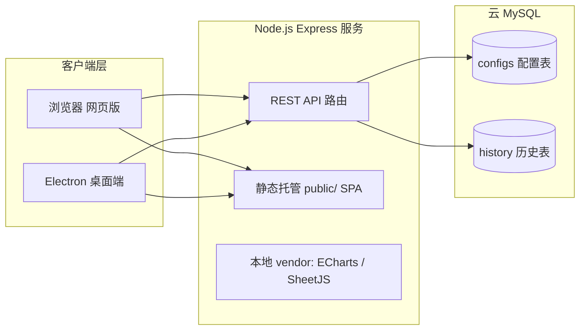

## 产品概述

将现有 Python/Tkinter 桌面加权随机数生成器重写为 Node.js 全栈应用：网页版与 Electron 桌面客户端共享同一套前端代码，配置与历史记录存储在云 MySQL（your_ip:3306/random），采用无需登录的单一共享配置库。

## 核心功能

- **数字与权重管理**：单个/区间/正则批量添加，单个/多选/区间删除，单个/多选/统一权重编辑，实时展示概率与统计信息（总数/总权重/平均概率）。
- **双模式抽取动画**：纯数字闪动模式（约 5 秒闪动、可手动停止）；大转盘模式（Canvas 扇形转盘按权重分配角度，减速旋转停在目标）。实际结果由加权算法提前决定，动画仅为视觉表现，模式可随时切换。
- **数据导入导出**：JSON 配置导入/导出；CSV 与 Excel(.xlsx) 导入（第一列数字、第二列权重，缺失默认 1）；提供示例模板下载；清空数据。
- **历史记录与统计图表**：每次抽取记录（时间、数字、权重），历史列表分页展示，ECharts 柱状图/饼图分析抽取分布。
- **云端配置管理**：多份配置的创建/编辑/删除/激活切换，网页版与客户端通过 REST API 双向同步。
- **双端交付**：网页版（浏览器访问本地服务）+ Electron 打包的 Windows 可执行程序（内嵌启动后端、双击即用，离线可用）。

## 交付物

完整源码及注释、Windows 一键启动脚本（网页版/桌面版/打包）、用户手册、数据库设计文档、示例导入模板。

## 技术栈

| 层 | 技术 | 说明 |
| --- | --- | --- |
| 后端 | Node.js + Express | REST API + 静态托管前端 |
| 数据库 | mysql2 连接池 + 云 MySQL | 连接 random@your_ip:3306/random，启动时幂等自动建表 |
| 前端 | 原生 HTML/CSS/JS 单页应用 | 网页版与 Electron 共享同一份代码 |
| 图表 | ECharts（本地 vendor） | 柱状图 + 饼图，离线可用 |
| 表格解析 | SheetJS (xlsx)（本地 vendor） | 前端本地解析 CSV/XLSX，免上传 |
| 桌面端 | Electron + electron-builder | NSIS 打包 Windows exe，主进程内嵌启动 Express 服务 |
| 配置 | dotenv + .env | 数据库凭据不入代码，.env 加入 gitignore |


## 关键设计决策

1. **前端加权随机 + 异步落库**：加权抽取算法在前端实现（等价 random.choices），动画开始前即确定目标结果（满足"预定结果"需求）；动画结束后异步 POST 历史记录，避免抽取等待云端网络往返，保证动画即时流畅。
2. **历史上报可靠性**：POST 失败写入 localStorage 队列，网络恢复后批量重放，防止云端抖动丢记录。
3. **Electron 复用后端**：主进程 require 同一 Express app 监听随机空闲端口，BrowserWindow 加载本机端口地址；前端 API 全部相对路径，双端代码零差异。
4. **多配置管理**：configs 表存多条配置（name + data JSON + is_active 激活标记），历史记录仅存抽取结果，不做配置隔离（无登录）。
5. **离线可用**：npm 安装 echarts/xlsx 后由脚本拷贝 UMD 产物到 public/vendor，不依赖 CDN。
6. **转盘性能**：扇形路径只绘制一次，动画阶段仅对 Canvas 整体做 rotate 变换（requestAnimationFrame 驱动），不逐帧重绘；颜色用预生成暖色色板循环，权重为 0 的数字不占扇区。

## 实施要点

- 数据库：连接池（默认 10 连接）；`CREATE TABLE IF NOT EXISTS` 幂等建表；连接失败时返回健康检查失败并由前端显示"云端离线"降级提示（本地功能仍可用）。
- API 统一返回 `{ code: 0, data, message }`；历史查询按时间倒序分页（默认 100 条）。
- 安全：express.json 限制 10mb；SQL 全部参数化查询；删除/覆盖/清空操作前端二次确认；日志不打印密码与完整配置内容。
- 跨平台：路径统一 path.join；提供 start-web.bat / start-desktop.bat / build-win.bat（Windows）与 start.sh（Linux 沙箱联调）。
- 打包说明：electron-builder NSIS 目标须在 Windows 开发机执行 `npm run build:win`；沙箱内仅保证代码与配置正确性。

## 系统架构



数据流：前端操作 → js/api.js（fetch 封装 + 失败重放队列）→ Express 路由 → mysql2 连接池 → 云 MySQL；抽取流程为本地加权预选 → Canvas/CSS 动画 → 结束后异步 POST 历史。

## 目录结构

```
/opt/random/
├── package.json                 # [NEW] 依赖与脚本：dev/start/electron/build:win/copy-vendor
├── .env                         # [NEW] 云 MySQL 连接配置（random@your_ip:3306/random）
├── .env.example                 # [NEW] 配置模板（不含真实密码）
├── .gitignore                   # [NEW] 忽略 node_modules/.env/dist
├── server/
│   ├── index.js                 # [NEW] Express 入口：中间件、静态托管、路由挂载；导出 app 供 Electron 复用
│   ├── db.js                    # [NEW] mysql2 连接池 + 幂等建表（configs/history）+ 连接健康检查
│   ├── logger.js                # [NEW] 统一时间戳日志（不含敏感信息）
│   └── routes/
│       ├── configs.js           # [NEW] 配置 CRUD + 激活切换 + 当前激活配置接口
│       └── history.js           # [NEW] 历史写入/分页查询/清空/统计聚合接口
├── public/
│   ├── index.html               # [NEW] SPA 入口：顶部导航 + 三视图容器 + vendor 引用
│   ├── css/style.css            # [NEW] 暗色霓虹风格：布局/卡片/按钮/动画/响应式
│   ├── vendor/                  # [NEW] echarts.min.js、xlsx.full.min.js（构建脚本拷贝）
│   └── js/
│       ├── api.js               # [NEW] fetch 封装：统一错误处理、历史上报失败重放队列
│       ├── random.js            # [NEW] 加权随机预选算法 + 数字校验/区间/正则解析工具
│       ├── wheel.js             # [NEW] Canvas 转盘：扇形绘制、加权角度、rAF 减速动画
│       ├── drawView.js          # [NEW] 抽取视图：模式切换、数字闪动、开始/停止、结果展示
│       ├── dataView.js          # [NEW] 数据视图：表格编辑、批量操作、CSV/XLSX/JSON 导入导出、云端同步
│       ├── statsView.js         # [NEW] 统计视图：历史列表 + ECharts 柱状图/饼图
│       └── app.js               # [NEW] 视图路由、顶部导航、全局状态（配置/历史/模式）
├── electron/
│   ├── main.js                  # [NEW] 主进程：找空闲端口、启动 server、创建 BrowserWindow
│   └── preload.js               # [NEW] 安全预加载（contextIsolation，最小化暴露）
├── scripts/
│   ├── copy-vendor.js           # [NEW] 拷贝 node_modules 中 echarts/xlsx 到 public/vendor
│   └── gen-template.js          # [NEW] 生成 CSV/Excel 示例模板到 docs/
├── docs/
│   ├── 用户手册.md               # [NEW] 双端使用说明、导入导出、云端同步、打包说明
│   └── 数据库设计文档.md         # [NEW] 表结构、字段说明、API 清单
├── start-web.bat                # [NEW] Windows 一键启动网页版（自动 npm install + 启动）
├── start-desktop.bat            # [NEW] Windows 一键启动桌面版
├── build-win.bat                # [NEW] Windows 一键打包 exe（electron-builder）
└── start.sh                     # [NEW] Linux 联调启动脚本
```

## 数据库设计（要点）

- **configs**：id INT PK AI、name VARCHAR(100)、data JSON、is_active TINYINT(1) 默认 0、created_at/updated_at DATETIME；激活配置唯一（切换时事务内清旧置新）。
- **history**：id INT PK AI、number INT、weight INT、created_at DATETIME 默认 CURRENT_TIMESTAMP；索引 (created_at)、(number)。
- 统计 SQL：`SELECT number, COUNT(*) cnt, AVG(weight) avg_w FROM history GROUP BY number`。

## API 清单（要点）

- 配置：GET/PUT /api/config/active（读取/保存当前激活配置）、GET/POST /api/configs（列表/新建）、PUT/DELETE /api/configs/:id（更新/删除）、POST /api/configs/:id/activate（激活切换）。
- 历史：POST /api/history（单条写入）、GET /api/history（分页查询）、DELETE /api/history（清空）、GET /api/stats（分布聚合）。
- 系统：GET /api/health（含数据库连通状态）、GET /api/template.csv（示例模板下载）。

## 设计风格

采用**暗色霓虹抽奖风**：深邃蓝紫渐变背景（#0F1023 至 #1A1B2E），中央转盘为绝对视觉焦点，金色琥珀渐变主按钮带发光悬停效果，紫罗兰与青色为辅助强调色。玻璃拟态卡片（backdrop-filter 半透明面板 + 细描边 + 悬浮微动效），大数字展示使用加粗字体加霓虹光晕，营造抽奖仪式感。所有切换与抽取动画采用 200-400ms 缓动过渡，交互反馈及时（按钮按压、加载转圈、Toast 提示）。桌面端为 Web 应用，采用顶部导航 + 单页三视图切换布局（抽取/数据/统计），适配 1280px 以上桌面窗口，窄屏（小于 900px）降级为纵向流式布局。

## 页面规划

1. **抽取视图**：顶部导航（品牌标识 + 三个视图 Tab + 云端状态指示）。主体居中大转盘（Canvas，可切换纯数字模式时转盘隐藏改为大号数字闪动区）；转盘下方大号结果展示区与"开始抽取/停止"主按钮；左侧浮动配置面板（当前激活配置名、切换模式、配置快速选择）。动画结束后结果以霓虹大字定格并弹出 Toast。
2. **数据视图**：左侧数字表格（数字/权重/概率三列，行内双击编辑权重、多选操作栏）；右侧控制面板分组（添加单个/区间/正则、删除、批量权重、统一权重）；底部操作区（JSON 导入导出、CSV/XLSX 导入、模板下载、清空、云端保存/拉取）。统计信息条（总数/总权重/平均概率）常驻顶部。
3. **统计视图**：顶部历史汇总卡片行（抽取总次数/最新抽取/最高频数字）；左侧 ECharts 柱状图（次数分布）、右侧饼图（占比）；下方历史记录分页表格（时间/数字/权重），支持清空历史。
4. **云端管理面板**（数据视图内嵌）：配置列表（激活标记/新建/编辑/删除/激活），保存本地配置到云端、从云端拉取覆盖本地，带二次确认。

## Agent Extensions

### SubAgent

- **code-explorer**
- 用途：在重写前深入分析现有 random.py 的交互行为与边界处理细节（双击编辑、区间反转、正则添加、停止动画等），形成功能核对清单，确保重写不遗漏任何现有行为。
- 预期产出：现有功能行为清单，作为前端数据视图与抽取视图实现的验收依据。

### Skill

- **xlsx**
- 用途：生成标准 Excel 示例模板文件（docs/示例模板.xlsx，第一列数字、第二列权重），与 CSV 模板一同提供给用户下载。
- 预期产出：可被 SheetJS 前端解析的合法 .xlsx 示例文件，验证导入流程。